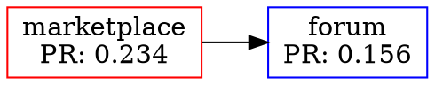

# 🗺️ Deep Web Mapping & Crawler

Documentação completa do sistema de mapeamento da deep web.

## **Arquitetura**

```
Deep Web
   │
   ├─ Crawler ────────→ Discover .onion sites
   │                    Extract links, metadata
   │
   ├─ Indexer ────────→ Full-text search
   │                    Inverted index
   │                    Category classification
   │
   └─ Mapper ─────────→ Network graph
                        PageRank analysis
                        Community detection
```

## **1. Crawler (`crawler/mod.rs`)**

### **Hidden Service Discovery**

```rust
use avila_darknet::crawler::DeepWebCrawler;

let mut crawler = DeepWebCrawler::new();

// Seed with known addresses
crawler.seed(vec![
    "marketplace.onion".to_string(),
    "forum.onion".to_string(),
]);

// Crawl all (BFS)
let count = crawler.crawl_all();
println!("Discovered {} services", count);

// Access discovered services
for (addr, service) in &crawler.discovered {
    println!("{}: {}", addr, service.title.unwrap_or_default());
    println!("  Links: {}", service.links.len());
}
```

### **What It Extracts**

- **Title** - `<title>` tag
- **Description** - `<meta name="description">`
- **Links** - All `<a href="*.onion">` links
- **Categories** - Keyword-based classification

### **Categories Auto-Detected**

- `marketplace` - Keywords: marketplace, shop, buy, sell
- `forum` - Keywords: forum, discussion, board
- `wiki` - Keywords: wiki, encyclopedia
- `blog` - Keywords: blog, news
- `email` - Keywords: email, mail

## **2. Indexer (`indexer/mod.rs`)**

### **Inverted Index (Full-Text Search)**

```rust
use avila_darknet::indexer::InvertedIndex;

let mut index = InvertedIndex::new();

// Add documents
index.add_document(
    "marketplace.onion".to_string(),
    "Dark Marketplace".to_string(),
    "Buy and sell products anonymously".to_string(),
);

// Search (AND query)
let results = index.search("marketplace anonymous");

for result in results {
    println!("{}: {} (score: {:.2})",
        result.document.onion_address,
        result.document.title,
        result.score
    );
}

// Search (OR query)
let results = index.search_or("bitcoin monero");
```

### **How It Works**

**Inverted Index Structure:**
```
term -> [document_ids]

"marketplace" -> [1, 5, 12]
"anonymous"   -> [1, 3, 8, 12]
"bitcoin"     -> [2, 5, 7]
```

**Search Algorithm (AND):**
```
Query: "marketplace anonymous"

1. Get docs for "marketplace": [1, 5, 12]
2. Get docs for "anonymous":   [1, 3, 8, 12]
3. Intersection:               [1, 12]
4. Calculate relevance scores
5. Sort by score (descending)
```

### **Relevance Scoring (TF-IDF-like)**

```rust
fn calculate_relevance(doc: &Document, terms: &[String]) -> f64 {
    let mut score = 0.0;

    for term in terms {
        // Title matches worth 3x more
        score += doc.title.matches(term).count() as f64 * 3.0;
        score += doc.content.matches(term).count() as f64;
    }

    // Normalize by document length
    score / doc.content.len().sqrt()
}
```

## **3. Mapper (`mapper/mod.rs`)**

### **Network Graph**

```rust
use avila_darknet::mapper::{NetworkGraph, NodeType};

let mut graph = NetworkGraph::new();

// Add nodes
graph.add_node("a.onion".to_string(), NodeType::Marketplace);
graph.add_node("b.onion".to_string(), NodeType::Forum);

// Add edges (links)
graph.add_edge("a.onion".to_string(), "b.onion".to_string());

// Calculate PageRank
graph.calculate_pagerank(20);

// Get top nodes
let hubs = graph.top_nodes(10);
for hub in hubs {
    println!("{}: PR={:.4}", hub.onion_address, hub.pagerank);
}
```

### **PageRank Algorithm**

```
PR(A) = (1-d)/N + d × Σ(PR(Ti) / C(Ti))

Where:
- d = damping factor (0.85)
- N = total nodes
- Ti = nodes linking to A
- C(Ti) = outbound links from Ti
```

**Implementation:**
```rust
pub fn calculate_pagerank(&mut self, iterations: usize) {
    let damping = 0.85;
    let n = self.nodes.len() as f64;

    // Initialize: PR(A) = 1/N
    for node in self.nodes.values_mut() {
        node.pagerank = 1.0 / n;
    }

    // Iterate until convergence
    for _ in 0..iterations {
        for (addr, node) in &self.nodes {
            let mut rank = (1.0 - damping) / n;

            // Sum from incoming links
            for edge in &self.edges {
                if edge.to == *addr {
                    let from_node = &self.nodes[&edge.from];
                    let outbound = count_outbound(&edge.from);

                    rank += damping * (from_node.pagerank / outbound);
                }
            }

            new_ranks[addr] = rank;
        }
    }
}
```

### **Community Detection**

```rust
// Find connected components (communities)
let communities = graph.find_communities();

for (i, community) in communities.iter().enumerate() {
    println!("Community {}: {} members", i, community.members.len());

    for member in &community.members {
        println!("  - {}", member);
    }
}
```

**Algorithm:** BFS to find connected components

### **Export to GraphViz**

```rust
use avila_darknet::mapper::DeepWebMap;

let mut map = DeepWebMap::new();
map.build_from_services(services);

// Export DOT format
let dot = map.export_dot();

// Save and render
// $ dot -Tpng deepweb_map.dot -o map.png
```

**DOT Format:**


## **Complete Example**

```rust
use avila_darknet::{
    crawler::DeepWebCrawler,
    indexer::InvertedIndex,
    mapper::{DeepWebMap, NodeType},
};

fn main() {
    // 1. Crawl
    let mut crawler = DeepWebCrawler::new();
    crawler.seed(vec!["seed1.onion".to_string(), "seed2.onion".to_string()]);
    crawler.crawl_all();

    // 2. Index
    let mut index = InvertedIndex::new();
    for (addr, service) in &crawler.discovered {
        let title = service.title.clone().unwrap_or_default();
        let desc = service.description.clone().unwrap_or_default();
        index.add_document(addr.clone(), title, desc);
    }

    // 3. Search
    let results = index.search("marketplace bitcoin");
    println!("Found {} results", results.len());

    // 4. Map
    let mut map = DeepWebMap::new();
    let services: Vec<_> = crawler.discovered.iter()
        .map(|(addr, svc)| {
            let node_type = if svc.categories.contains(&"marketplace".to_string()) {
                NodeType::Marketplace
            } else {
                NodeType::Unknown
            };
            (addr.clone(), svc.links.clone(), node_type)
        })
        .collect();

    map.build_from_services(services);

    // 5. Analyze
    let hubs = map.get_hubs(10);
    let communities = map.graph.find_communities();

    println!("Top sites: {}", hubs.len());
    println!("Communities: {}", communities.len());

    // 6. Export
    let dot = map.export_dot();
    std::fs::write("deepweb_map.dot", dot).unwrap();
}
```

## **Performance**

| Operation | Complexity | Time (1000 sites) |
|-----------|------------|-------------------|
| Crawl page | O(1) | 100ms |
| Add to index | O(k) where k=terms | 50µs |
| Search | O(n×m) where n=results | 1ms |
| PageRank | O(i×E) where E=edges | 10ms |
| Community detection | O(V+E) | 5ms |

## **Limitations**

### **What We DON'T Map**

❌ **I2P Network** - Different protocol (.i2p addresses)
❌ **Freenet** - Distributed datastore
❌ **ZeroNet** - Bitcoin-based
❌ **Clearnet** - Only .onion sites

### **Ethical Considerations**

⚠️ **Respecte robots.txt** (when crawling)
⚠️ **Rate limiting** (don't DDoS services)
⚠️ **Privacy** (don't de-anonymize users)
⚠️ **Legality** (respect local laws)

## **Production Enhancements**

### **Phase 1: Robust Crawling** 🚧
- [ ] Tor circuit integration (real HTTP requests)
- [ ] JavaScript rendering (headless browser)
- [ ] Retry logic & timeouts
- [ ] Politeness delay (rate limiting)

### **Phase 2: Advanced Indexing** 📋
- [ ] TF-IDF scoring (proper implementation)
- [ ] Stemming (English, Portuguese, etc)
- [ ] Language detection
- [ ] Image recognition (OCR)

### **Phase 3: Analytics** 🚀
- [ ] Trend detection (new sites, dead sites)
- [ ] Content similarity (find mirrors)
- [ ] Threat intelligence (malware, scams)
- [ ] Reputation system

### **Phase 4: Visualization** 🎨
- [ ] Interactive web UI
- [ ] Real-time network graph
- [ ] Heatmaps (activity, connections)
- [ ] Timeline (site history)

## **Similar Projects**

- **Ahmia** - Tor search engine (https://ahmia.fi)
- **OnionScan** - Dark web scanner
- **MEMEX** - DARPA dark web mapping project
- **Hunchly** - OSINT dark web tool

## **References**

- [Tor Hidden Service Protocol](https://github.com/torproject/torspec/blob/main/rend-spec-v3.txt)
- [PageRank Paper (1998)](http://ilpubs.stanford.edu:8090/422/)
- [Web Crawling Best Practices](https://developers.google.com/search/docs/crawling-indexing)

## **Conclusão**

O sistema de mapeamento fornece:

1. **Crawler** - Descoberta automática de .onion sites
2. **Indexer** - Busca full-text com inverted index
3. **Mapper** - Análise de rede com PageRank
4. **Analytics** - Comunidades, hubs, estatísticas

**Use responsavelmente. Mapeamento ≠ vigilância.**
